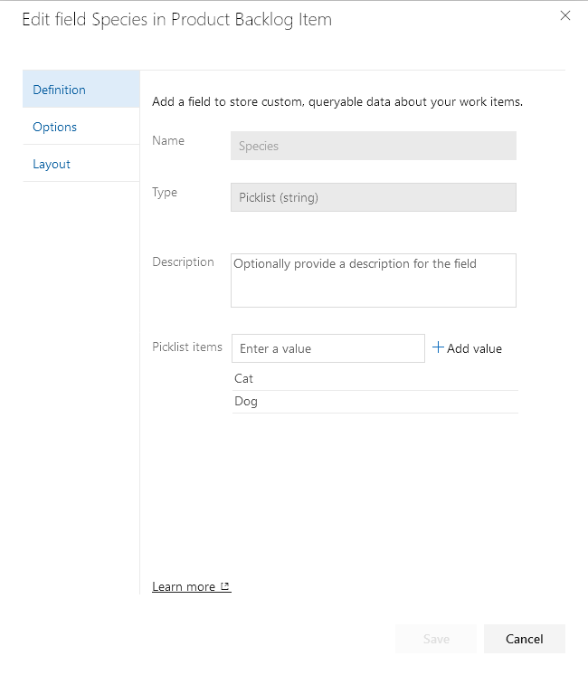
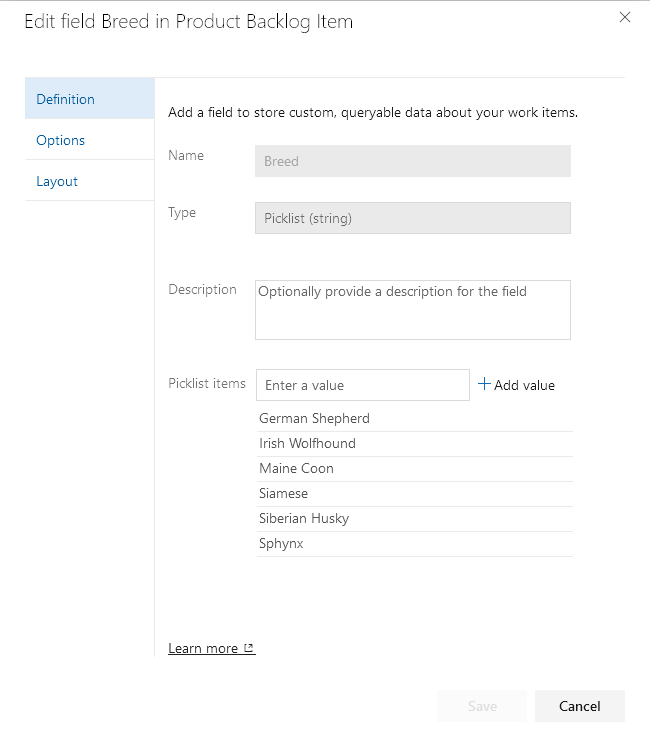

# Dependent Picklists Extension for Azure DevOps

This extension can be found in the [Azure DevOps Marketplace](https://marketplace.visualstudio.com/items?itemName=njpaul.dependent-picklists 'Download Dependent Lists extension').

This extension is based on the popular [Cascading Lists](https://marketplace.visualstudio.com/items?itemName=ms-devlabs.cascading-picklists-extension) extension.

## Why use this extension?
This extension adds behavior to the original extension:
- This can now be installed on Azure DevOps Server (on-prem) deployments
- Hints can be provided to automatically populate the parent picklist.
  This can make it easier to select items from the dependent picklist.
- Dependent picklist items that aren't valid for the parent selection now cause a form error.
  Previously the dependent selection was cleared with no indication as to why.
- Clearing the parent picklist value now causes the dependent list to show all possible values.
  Previously, the only values displayed were the ones associated with the parent value before it was cleared.

When it makes sense to do so, PRs will be submitted back upstream for consideration.

## Dependent Picklists

This extension uses the `ms.vss-work-web.work-item-form` contribution point that enables you to build a dependent picklist on the work item form.
Dependent picklists are made up of two seperate fields: a parent field and a dependent (child) field.
When a value is selected from the parent picklist, the dependent picklist will show only the values associated with the parent value.


### Create a picklist

First, create a picklist of parent values.



Second, create a dependent picklist containing **all** possible values, regardless of parent value.



Finally, configure how those values get associated with the parent values in the extension configuration.


### Configure

Once both picklists have been created, you can configure which dependent picklist values will be associated with the parent values.
You do this by going to the "Dependent Lists" Hub in the project settings.
From here, configure the values for the parent picklist so that when selected, the dependent values will be displayed.

You can also configure hints to pre-select the parent picklist value.
The parent picklist value will be set based on the provided hint, if any, if it has no value when the form is shown.
The only hint currently supported is `"Area Path"`.

Config example:
```json
{
  "version": "1",
  "cascades": {
    "Custom.Species": {
      "Cat": {
        "hint": {
          "when": "Area Path",
          "is": "My Project\\Cats"
        },
        "Custom.Breed": [
          "Siamese",
          "Sphynx",
          "Maine Coon"
        ]
      },
      "Dog": {
        "hint": {
          "when": "Area Path",
          "is": "My Project\\Dogs"
        },
        "Custom.Breed": [
          "Irish Wolfhound",
          "Siberian Husky",
          "German Shepherd"
        ]
      }
    }
  }
}
```

In the above example, if the Area Path of the work item is `"My Project\Cats"` or **any child of that Area Path**, the `Custom.Species` field will be set to `"Cat"`.

#### Tips

1. You must know the refname of the custom picklist fields.
   You can use [List Fields REST API](https://docs.microsoft.com/en-us/rest/api/azure/devops/wit/fields/list?view=azure-devops-rest-5.0) if you need help finding the value.

2. The values setup in the picklist and the values in the configuration must be an exact match.
   There is no validation to check or correct spelling mistakes in the values.

3. When using hints to populate the parent picklist, you can choose to hide the parent field on the form.
   This can be a useful technique to simplify the user experience and minimize user error.
   For example, the parent picklist value could represent a team and the dependent list could contain a list of values applicable to that team.
   The hint would populate the hidden field such that team members only have to fill in the dependent list value.

## Prerequisites

1. [Download and install NodeJS](http://nodejs.org)

2. [Install tfx-cli](https://docs.microsoft.com/en-us/vsts/extend/publish/command-line?view=vsts)
    ```
    npm install --global tfx-cli
    ```

3. Install dev prerequisites
    ```
    npm install
    ```

### Build the extension

```
npm run build-release
npm run package-release
```

### Run the extension server locally
First build and package the development version of the extension:
```
npm run build-dev
npm run package-dev
```

Then install the extension.
This only has to be done once.
After installing the extension, additional changes will be served by webpack.

Serve the extension locally:
```
npm run start
```

### Publish the dev extension to marketplace

Follow the instructions here:

[Package, publish, unpublish, and install Azure DevOps extensions
](https://docs.microsoft.com/en-us/azure/devops/extend/publish/overview?view=azure-devops)

# Contributing

This project welcomes contributions and suggestions.
